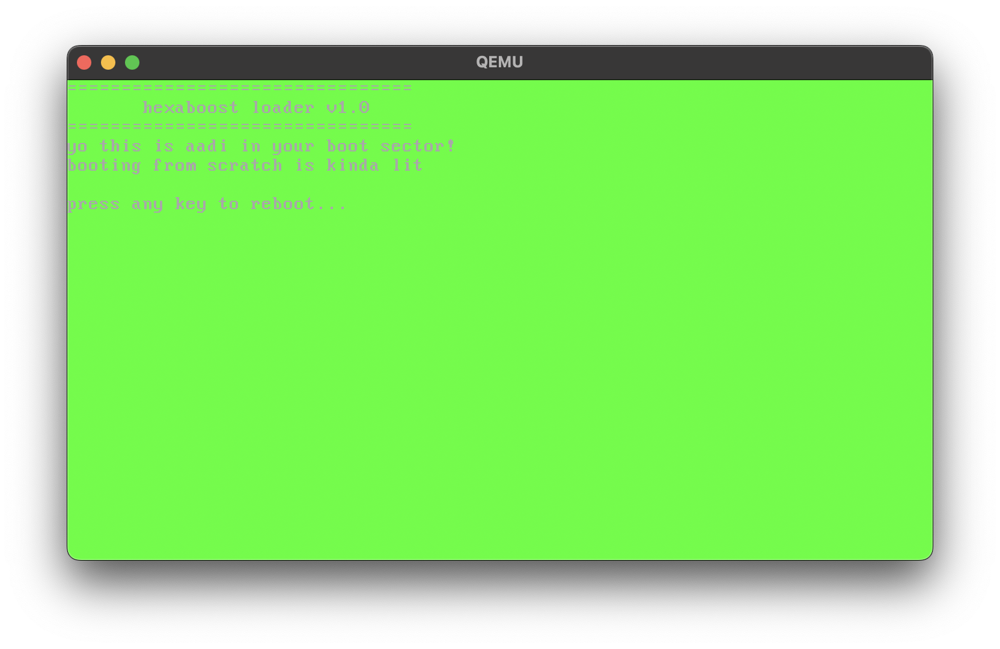

# hexaboost

a super minimal bootloader written in x86 assembly. this project shows how computers boot up at the lowest level - just raw metal and code.

## screenshot



## what it does

- runs in 16-bit real mode (old school)
- clears the screen for that clean aesthetic
- shows green text because hacker vibes
- waits for you to press something
- reboots when you're done

## how this actually works

when your pc starts up, the bios looks for bootable stuff. if it finds something with the magic 0xAA55 signature, it loads that first sector (512 bytes) into memory at 0x7C00 and jumps there. hexaboost is exactly that - just the bare minimum to make your computer do something cool.

## running this yourself

### stuff you need
- nasm (to build the assembly)
- qemu (to test without messing with real hardware)

### build it
```bash
nasm -f bin hexaboost.asm -o hexaboost.bin
```

### test it
```bash
qemu-system-i386 -fda hexaboost.bin
```

### make a bootable usb (careful! this will wipe your drive)
```bash
# replace /dev/sdX with your usb drive
sudo dd if=hexaboost.bin of=/dev/sdX bs=512 count=1
```

## learn more stuff

if you think this is cool, check these out:
- [osdev wiki](https://wiki.osdev.org/)
- [ctyme](https://www.ctyme.com/intr/rb-0096.htm)
- youtube has tons of tutorials on low-level coding

## license

mit license - do whatever you want with this

## made by

someone thinks low-level stuff is underrated